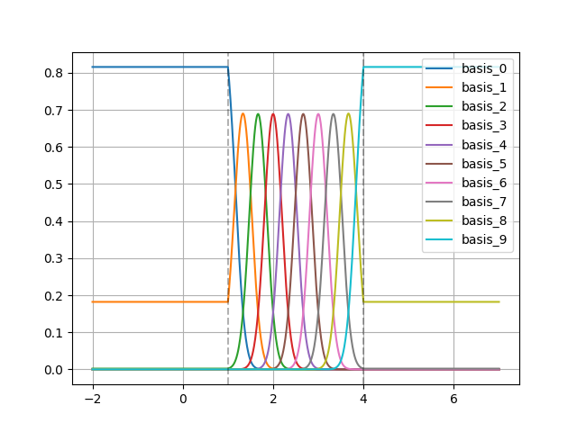
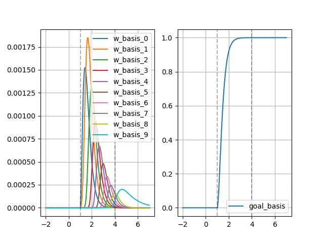

# 3. Phase and Basis Generation
You can view the main features of the Phase Generator and Basis Generator in this section.

&nbsp;
### 3.1 Demo

You can create the phase and basis instance by calling the corresponding classes. To create the Basis Generator, you need create a Phase Generator firstly. 

```python
phase_gn = LinearPhaseGenerator(tau=3, delay=1,
                                learn_tau=False, learn_delay=False)
basis_gn = NormalizedRBFBasisGenerator(phase_generator=phase_gn,
                                       num_basis=10,
                                       basis_bandwidth_factor=3,
                                       num_basis_outside=0)
basis_gn.show_basis(plot=True)
```

We also provide a [demo](../mp_pytorch/demo/demo_basis_gn.py) to visualize the norm RBF and ProDMPs basis functions.
You can call this demo as follows:
```python
from mp_pytorch import demo
demo.demo_norm_rbf_basis()
demo.dmmo_prodmp_basis()
```
The corresponding basis functions will be visualized as:

| Norm RBF Basis Functions             | ProDMPs Basis Functions           |
|--------------------------------------|-----------------------------------|
|   |  |

&nbsp;
### 3.2 Phase Generator
We provide the Phase Generator Interface to help to define the custom Movement Primitives Method. 
The main features of the Interface and derived Generator are as follows: 

| Classes                | Main Functions                                    | Description                                                                                                   |
|------------------------|---------------------------------------------------|---------------------------------------------------------------------------------------------------------------|
| PhaseGenerator         |                                                   | Abstract Basic Class for Phase Generators. Transfer time duration to [0, 1] range.                            |
|                        | `PhaseGenerator.phase`                            | Abstractmethod for phase interface.                                                                           |
|                        | `PhaseGenerator.unbound_phase`                    | Abstractmethod for unbound phase interface.                                                                   |
|                        | `PhaseGenerator.phase_to_time`                    | Abstractmethod for inverse operation, compute times given phase.                                              |
|                        | `PhaseGenerator.set_params`                       | Set parameters of current object and attributes                                                               |
|                        | `PhaseGenerator.get_params`                       | Return all learnable parameters.                                                                              |
|                        | `PhaseGenerator.get_params_bounds`                | Return all learnable parameters' bounds.                                                                      |
|                        | `PhaseGenerator.finalize`                         | Mark the phase generator as finalized so that the parameters cannot be updated any more.                      |
| RhythmicPhaseGenerator |                                                   | Rhythmic phase generator.                                                                                     |
| SmoothPhaseGenerator   |                                                   | Smooth phase generator with five order spline phase                                                           |
| LinearPhaseGenerator   |                                                   | Linear Phase Generator                                                                                        |
| ExpDecayPhaseGenerator |                                                   | Exponential decay phase generator                                                                             |

&nbsp;
### 3.3 Basis Generator
We provide the Basis Generator Interface to help to define the custom Movement Primitives Method. 
The main features of the Interface and derived Generator are as follows: 

| Classes                                 | Main Functions                                    | Description                                                              |
|-----------------------------------------|---------------------------------------------------|--------------------------------------------------------------------------|
| BasisGenerator                          |                                                   | Abstract Basic Class for Basis Generators                                |
|                                         | `BasisGenerator.basis`                            | Abstractmethod to generate value of single basis function at given time. |
|                                         | `BasisGenerator.basis_multi_dofs`                 | Interface to generate basis functions for multi-dof at given time        |
|                                         | `BasisGenerator.set_params`                       | Set parameters of current object and attributes                          |
|                                         | `BasisGenerator.get_params`                       | Return all learnable parameters                                          |
|                                         | `BasisGenerator.get_params_bounds`                | Return all learnable parameters' bounds                                  |
|                                         | `BasisGenerator.show_basis`                       | Visualize the basis functions for debug usage                            |
| RhythmicBasisGenerator                  |                                                   | Rhythmic Basis Generator                                                 |
| NormalizedRBFBasisGenerator             |                                                   | Normalized RBF basis generator                                           |
| ZeroPaddingNormalizedRBFBasisGenerator  |                                                   | Normalized RBF with zero padding basis generator                         |
| ProDMPBasisGenerator                    |                                                   | ProDMP basis generator                                                   |
|                                         | `ProDMP.pre_compute`                              | Precompute basis functions and other stuff.                              |
|                                         | `BasisGenerator.basis_and_phase`                  | Set basis and phase for the rhythmic basis generator                     |
|                                         | `BasisGenerator.times_to_indices`                 | Map time points to pre-compute indices                                   |

[Back to Overview](./)